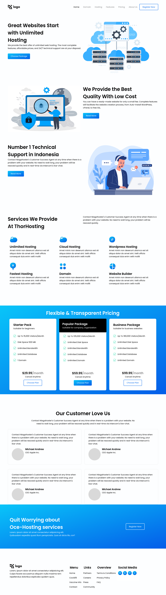

# Project11 [live link](https://css-projects-11.netlify.app/)

## By - Karan Chauhan

- CSS property I learned in this project
    - image sprites
    - flex-grow
    - flex-wrap
    - `calc()`

## Time taken to complete this project
    - 9 hours + 4 hours (responsiveness)

## Screenshot
